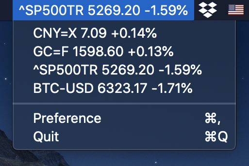

# TickerBar
A MacOS Menubar Showing Ticker Prices

	

<a href="https://github.com/ZhexiongLiu/TickerBar/releases/latest">
 		
	
	

## Ticker Bar
Ticker Bar dynamically shows ticker prices in menu bar.

	
	

## Manual download

* [Download latest version](https://github.com/ZhexiongLiu/TickerBar/releases/latest)
* Open and drag the app to the Applications folder.

## Related App
* [To-do Bar](https://github.com/ZhexiongLiu/TodoBar)

## License

MIT &copy; [Zhexiong Liu](https://github.com/ZhexiongLiu)
